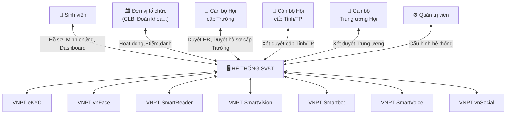
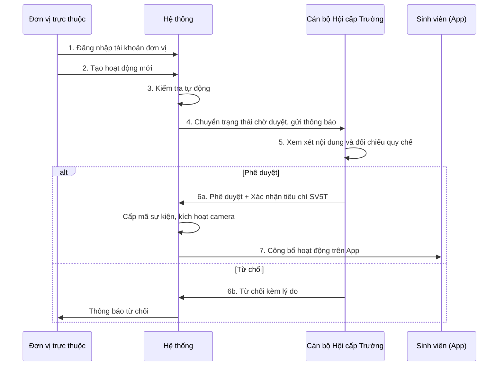
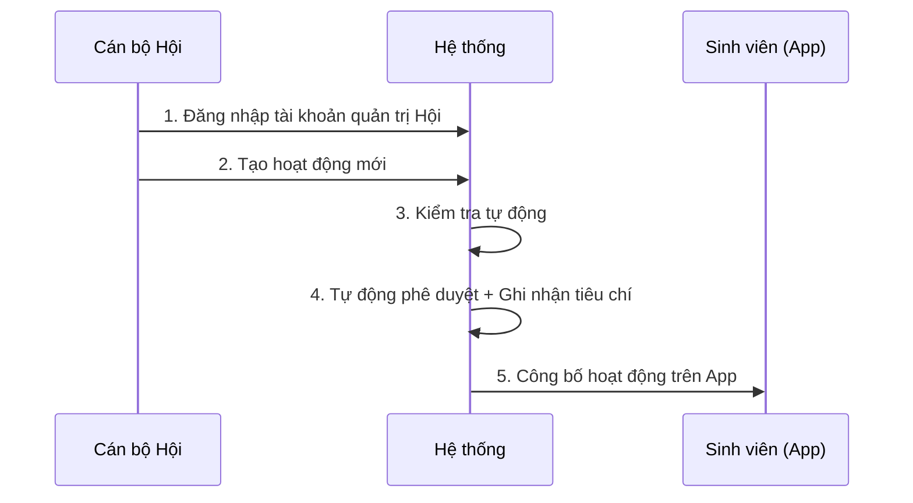
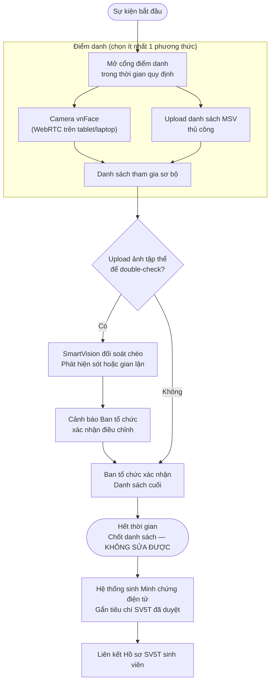
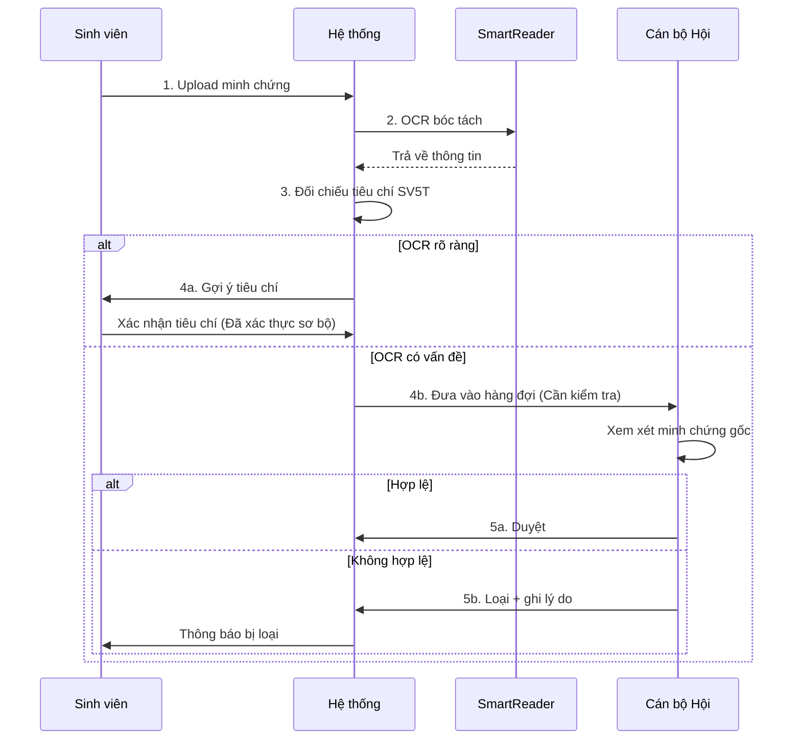
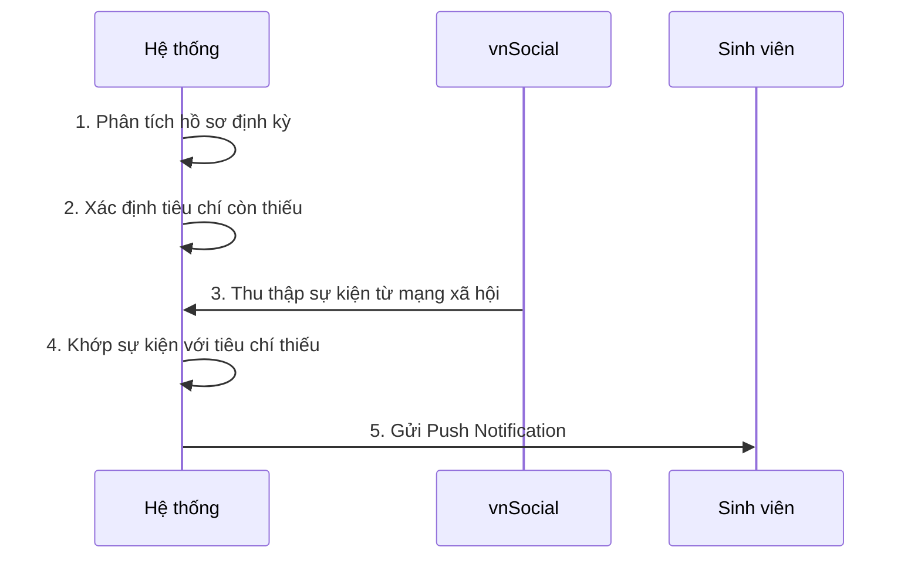
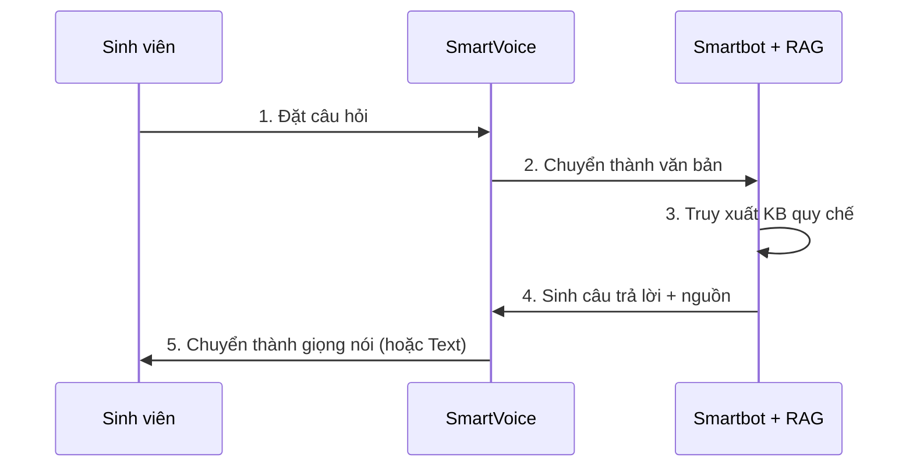
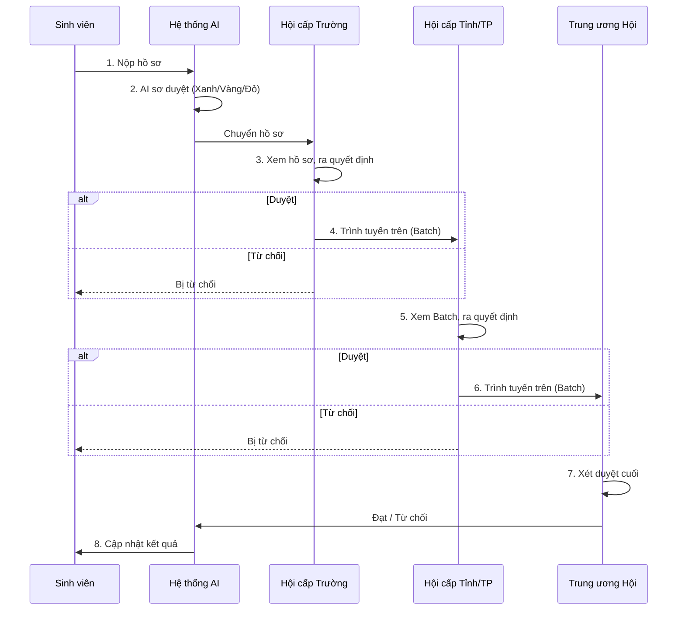
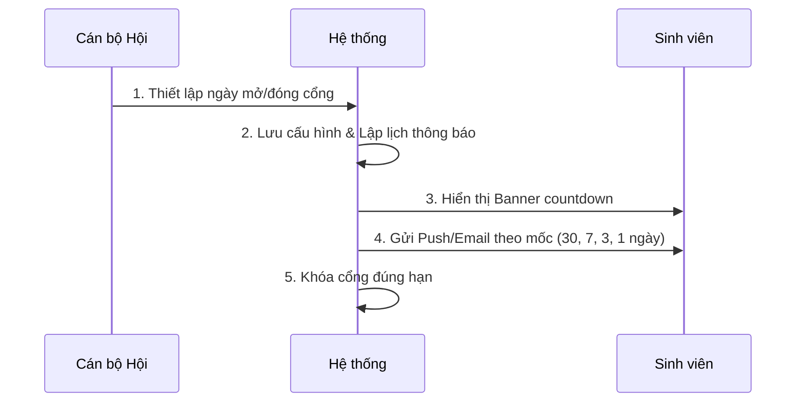

## III. PHÂN TÍCH NGHIỆP VỤ

### 3.1. Phạm vi hệ thống

Hệ thống hỗ trợ toàn bộ quy trình quản lý danh hiệu Sinh viên 5 tốt, bao gồm các nhóm chức năng sau:

| STT | Nhóm chức năng | Mô tả phạm vi |
|:---|:---|:---|
| 1 | Quản lý hoạt động | Đơn vị đăng ký hoặc Hội tự tạo hoạt động; Duyệt đúng cấp thẩm quyền; Quản lý hình thức điểm danh và tiêu chí SV5T |
| 2 | Ghi nhận tham gia | Điểm danh qua khuôn mặt (vnFace) hoặc danh sách; Đối soát bổ sung qua ảnh tập thể (SmartVision - tuỳ chọn) |
| 3 | Quản lý minh chứng | Sinh viên tải minh chứng ngoài hệ thống; OCR bóc tách; Cán bộ duyệt hoặc loại |
| 4 | Quản lý hồ sơ SV5T | Theo dõi tiến độ từng tiêu chí; Nộp đúng hạn thời gian; Không sửa được sau khi nộp |
| 5 | Xét duyệt phân cấp | Cấp Trường → Cấp Tỉnh/TP → Cấp Trung ương; Trình tuyến trên; Lưu lịch sử xét duyệt |
| 6 | Hỗ trợ AI | Chatbot hỏi đáp quy chế (RAG); AI OCR; AI sơ duyệt hồ sơ; Gợi ý hoạt động cá nhân hóa |
| 7 | Thống kê & báo cáo | Dashboard thời gian thực; Xuất báo cáo Excel/PDF theo cấp |
| 8 | Quản trị hệ thống | Quản trị tài khoản, đơn vị, tiêu chí, cửa sổ thời gian nộp theo từng Hội, lịch thông báo deadline tự động, API VNPT |

---

### 3.2. Các tác nhân trong hệ thống (Actors)

**Sơ đồ ngữ cảnh — Mermaid:**

**Mô tả tác nhân:**

| Actor | Vai trò | Thẩm quyền | Không có quyền |
|:---|:---|:---|:---|
| Sinh viên | Đối tượng chính | Tạo/nộp hồ sơ; Upload minh chứng; Dùng Chatbot | Duyệt hoạt động; Duyệt hồ sơ; Sửa hồ sơ sau khi nộp |
| Đơn vị tổ chức | CLB, Đoàn khoa, Liên chi Hội... | Tạo hoạt động; Điểm danh | Gán tiêu chí SV5T; Xét duyệt hồ sơ |
| Cán bộ Hội cấp Trường | Quản lý cấp Trường | Tạo hoạt động cấp Trường; Duyệt HĐ do CLB/Đoàn khoa tạo; Xét duyệt hồ sơ cấp Trường; Cấu hình cửa sổ thời gian nộp | Xem dữ liệu ngoài trường mình |
| Cán bộ Hội cấp Tỉnh/TP | Quản lý cấp Tỉnh/TP | Tạo hoạt động cấp Tỉnh/TP; Duyệt HĐ do Hội cấp Trường tạo (liên trường); Xét duyệt hồ sơ cấp Tỉnh; Cấu hình cửa sổ thời gian nộp; Có quyền can thiệp duyệt HĐ của đơn vị tổ chức cấp trường nếu cần | Xem dữ liệu tỉnh/TP khác |
| Cán bộ Trung ương Hội | Quản lý toàn quốc | Tạo HĐ cấp Trung ương; Xét duyệt cuối; Xem Dashboard toàn quốc; Cấu hình cửa sổ thời gian nộp; Có quyền can thiệp duyệt HĐ của cấp tỉnh/TP, đơn vị tổ chức cấp trường nếu cần | — |
| Quản trị viên | Vận hành hệ thống | Cấu hình toàn bộ; Quản lý API VNPT | — |

---

### 3.3. Dữ liệu đầu vào và đầu ra

#### 3.3.1. Dữ liệu đầu vào (Input)

| Nguồn | Loại dữ liệu | API xử lý | Mục đích |
|:---|:---|:---|:---|
| Sinh viên | CCCD + ảnh selfie liveness | VNPT eKYC | Xác thực định danh khi đăng ký |
| Sinh viên | Minh chứng (PDF, JPG, PNG,...) | VNPT SmartReader | Upload minh chứng ngoài hệ thống |
| Sinh viên | Câu hỏi văn bản / giọng nói | Smartbot + SmartVoice | Hỏi đáp quy chế |
| Đơn vị tổ chức / Cán bộ Hội | Thông tin hoạt động | — | Tạo hoạt động |
| Đơn vị tổ chức | Danh sách MSV | — | Điểm danh thủ công |
| Camera (tablet/laptop tại cổng) | Ảnh khuôn mặt real-time | VNPT vnFace (WebRTC) | Điểm danh tự động |
| Đơn vị tổ chức | Ảnh tập thể | VNPT SmartVision | Double-check danh sách điểm danh |
| Cán bộ Hội | File quy chế (PDF/Word) | RAG Engine | Knowledge Base cho Chatbot |
| Hệ thống (tự động) | Bài đăng mạng xã hội | VNPT vnSocial | Thu thập sự kiện từ Fanpage CLB |

#### 3.3.2. Dữ liệu đầu ra (Output)

| Đối tượng | Loại output | Mô tả |
|:---|:---|:---|
| Sinh viên | Dashboard tiến độ 5 tiêu chí | % hoàn thành từng tiêu chí, real-time |
| Sinh viên | Thông báo cảnh báo | Minh chứng bị loại, cửa sổ nộp sắp đóng |
| Sinh viên | Phản hồi Chatbot | Trả lời quy chế có trích dẫn nguồn |
| Đơn vị tổ chức | Danh sách điểm danh | Kết quả sau khi chốt, không thay đổi được |
| Cán bộ Hội cấp Trường | Danh sách HĐ chờ duyệt | Hoạt động do CLB/Đoàn khoa gửi lên |
| Cán bộ Hội cấp Trường | Hồ sơ đã AI phân loại | Cờ Xanh/Vàng/Đỏ để hỗ trợ xét duyệt |
| Cán bộ Hội Tỉnh/TW | Hồ sơ từ cấp dưới | Danh sách hồ sơ đã được cấp dưới duyệt |
| Tất cả cán bộ | Dashboard thống kê | Số liệu theo phạm vi quản lý, real-time |
| Tất cả cán bộ | Báo cáo Excel / PDF | Xuất theo cấp |
| Admin | Audit Log | Nhật ký thao tác hệ thống |

---

### 3.4. Quy trình nghiệp vụ cốt lõi

#### Quy trình 1. Quản lý hoạt động

**a. Hoạt động do các đơn vị trực thuộc Hội sinh viên cấp trường tổ chức**

**Tổng quan:** Đơn vị trực thuộc tổ chức đề xuất hoạt động → Cán bộ Hội cấp Trường phê duyệt và gán tiêu chí SV5T → Hoạt động được kích hoạt cho phép điểm danh.

**Biểu đồ quy trình (Mermaid):**

**Luồng thực hiện:**

| Bước | Chủ thể | Hành động | Kết quả / Điều kiện |
|:---|:---|:---|:---|
| 1 | Đơn vị tổ chức | Đăng nhập tài khoản đơn vị trực thuộc (CLB/Đoàn khoa) | Truy cập vào giao diện quản lý của đơn vị |
| 2 | Đơn vị tổ chức | Tạo hoạt động mới | Khai báo: tên, nội dung, thời gian, địa điểm, tiêu chí đề xuất, hình thức điểm danh |
| 3 | Hệ thống | Kiểm tra tự động | Kiểm tra thông tin bắt buộc, thời hạn hợp lệ, quyền đơn vị, chống trùng lặp |
| 4 | Hệ thống | Chuyển trạng thái → Chờ duyệt | Gửi thông báo đến Cán bộ Hội cấp Trường |
| 5 | Cán bộ Hội cấp Trường | Xem xét nội dung và đối chiếu quy chế | Kiểm tra tiêu chí, cấp tổ chức, tính phù hợp |
| 6a | Cán bộ Hội cấp Trường | Phê duyệt + Xác nhận tiêu chí SV5T | Hệ thống cấp mã sự kiện, kích hoạt camera điểm danh |
| 6b | Cán bộ Hội cấp Trường | Từ chối kèm lý do | Hệ thống thông báo lý do về cho Đơn vị đề xuất |
| 7 | Hệ thống | Công bố hoạt động | Sinh viên thấy hoạt động trên App, có thể đăng ký/tham gia |

**b. Hoạt động do Hội sinh viên trực tiếp tổ chức**

**Tổng quan:** Cán bộ Hội Sinh viên (cấp Trường, cấp Tỉnh/TP hoặc Trung ương) trực tiếp tạo hoạt động của cấp mình → Hệ thống tự động duyệt, gán tiêu chí SV5T ngay lập tức mà không cần qua bước chờ duyệt.

**Biểu đồ quy trình (Mermaid):**

**Luồng thực hiện:**

| Bước | Chủ thể | Hành động | Kết quả / Điều kiện |
|:---|:---|:---|:---|
| 1 | Cán bộ Hội | Đăng nhập tài khoản quản trị Hội (Trường/Tỉnh/TW) | Truy cập vào giao diện quản lý của Hội |
| 2 | Cán bộ Hội | Tạo hoạt động mới | Khai báo: tên, nội dung, thời gian, địa điểm, tiêu chí áp dụng, hình thức điểm danh |
| 3 | Hệ thống | Kiểm tra tự động | Kiểm tra thông tin bắt buộc, thời hạn, quyền hạn của cán bộ |
| 4 | Hệ thống | Tự động phê duyệt + Ghi nhận tiêu chí | Không cần chờ duyệt. Hệ thống tự cấp mã sự kiện, kích hoạt điểm danh |
| 5 | Hệ thống | Công bố hoạt động | Sinh viên thấy hoạt động trên App, có thể đăng ký/tham gia |

---

#### Quy trình 2. Ghi nhận tham gia hoạt động

**Tổng quan:** Hoạt động diễn ra → Đơn vị điểm danh (đa phương thức) → Chốt danh sách → Hệ thống sinh minh chứng điện tử.

**Biểu đồ quy trình (Mermaid):**

**Luồng thực hiện:**

| Bước | Chủ thể | Hành động | Chuyển sang |
|:---|:---|:---|:---|
| 1 | Ban tổ chức | Chọn hình thức điểm danh (Camera / Danh sách / Kết hợp) | Cổng điểm danh mở |
| 2a | Hệ thống + vnFace | Capture frame từ camera → Gọi API vnFace → Ghi nhận < 2 giây/người | Cập nhật danh sách real-time |
| 2b | Ban tổ chức | Upload file MSV thủ công (Excel/CSV) | Hệ thống tự động bóc tách, kiểm tra tồn tại và tính hợp lệ của MSV |
| 3 | Hệ thống | Tổng hợp danh sách tham gia sơ bộ | Gộp (merge) dữ liệu Camera và Excel, tự động lọc trùng lặp (1 sinh viên chỉ tính 1 lần) |
| 3 (Tùy chọn) | Ban tổ chức | Upload ảnh tập thể sau sự kiện | SmartVision đối soát, cảnh báo chênh lệch |
| 4 (Tùy chọn) | Ban tổ chức | Xem cảnh báo SmartVision, điều chỉnh nếu cần | Trước khi hết thời gian |
| 5 | Hệ thống | Hết thời gian → Tự động chốt danh sách | Chốt danh sách tham gia |
| 6 | Hệ thống | Sinh minh chứng điện tử, gắn tiêu chí SV5T đã duyệt | Liên kết hồ sơ sinh viên |

---

#### Quy trình 3. Quản lý minh chứng của sinh viên

**Tổng quan:** Sinh viên tải minh chứng bên ngoài (chứng chỉ, giấy khen) → AI OCR bóc tách → Đối chiếu tiêu chí + Định danh → Gán cờ → Cán bộ quyết định.

**Biểu đồ quy trình (Mermaid):**

**Luồng thực hiện:**

| Bước | Chủ thể | Hành động | Chuyển sang |
|:---|:---|:---|:---|
| 1 | Sinh viên | Upload minh chứng | → Đang xử lý |
| 2 | SmartReader | OCR bóc tách: Họ tên, Ngày cấp, Đơn vị, Loại chứng nhận | — |
| 3 | Rule Engine | Đối chiếu với bộ tiêu chí SV5T | Gợi ý tiêu chí |
| 4a | Hệ thống | OCR rõ ràng → Sinh viên xác nhận tiêu chí | → Đã xác thực sơ bộ |
| 4b | Hệ thống | OCR có vấn đề → Đưa vào hàng đợi cán bộ | → Cần kiểm tra |
| 5a | Cán bộ Hội | Xem minh chứng gốc, xác nhận hợp lệ | → Đã duyệt |
| 5b | Cán bộ Hội | Xác nhận không hợp lệ, ghi lý do | → Bị loại |

**Trạng thái minh chứng:**

| Trạng thái | Mô tả | Xử lý tiếp |
|:---|:---|:---|
| Đang xử lý | OCR đang chạy | Hệ thống |
| Đã xác thực sơ bộ | OCR thành công, sinh viên đã xác nhận tiêu chí | Gắn vào hồ sơ |
| Cần kiểm tra | OCR có vấn đề, chờ cán bộ | Cán bộ Hội |
| Đã duyệt | Cán bộ xác nhận hợp lệ | Gắn vào hồ sơ |
| Bị loại | Cán bộ xác nhận không hợp lệ | Sinh viên upload lại nếu có bản khác |

---

#### Quy trình 4. AI hỗ trợ sinh viên

**a. AI gợi ý hoạt động phù hợp**

**Tổng quan:** Hệ thống định kỳ phân tích hồ sơ từng sinh viên, xác định tiêu chí còn thiếu và gợi ý các sự kiện phù hợp thu thập được từ mạng xã hội qua vnSocial.

**Biểu đồ quy trình (Mermaid):**

**Luồng thực hiện:**

| Bước | Chủ thể | Hành động | Kết quả |
|:---|:---|:---|:---|
| 1 | Hệ thống (định kỳ) | Phân tích hồ sơ tất cả sinh viên đang rèn luyện | Tính % hoàn thành từng tiêu chí |
| 2 | Hệ thống | Xác định sinh viên còn thiếu tiêu chí nào | Danh sách tiêu chí thiếu theo sinh viên |
| 3 | vnSocial | Thu thập bài đăng sự kiện từ Fanpage CLB, Đoàn trường, Hội | Danh sách sự kiện sắp diễn ra |
| 4 | Hệ thống | Khớp sự kiện với tiêu chí còn thiếu của từng sinh viên | Danh sách gợi ý cá nhân hóa |
| 5 | Hệ thống | Gửi Push Notification đến sinh viên | Sinh viên nhận gợi ý sự kiện phù hợp |

**b. AI Chatbot hỏi đáp quy chế**

**Tổng quan:** Sinh viên hỏi về quy chế xét danh hiệu, điều kiện tham gia, hướng dẫn hồ sơ... bằng văn bản hoặc giọng nói. Smartbot truy xuất Knowledge Base từ các văn bản quy chế đã được Hội upload vào hệ thống và trả lời có trích dẫn nguồn.

**Biểu đồ quy trình (Mermaid):**

**Luồng thực hiện:**

| Bước | Chủ thể | Hành động | Kết quả |
|:---|:---|:---|:---|
| 1 | Sinh viên | Đặt câu hỏi bằng văn bản hoặc giọng nói | — |
| 2 | SmartVoice (nếu giọng nói) | Chuyển giọng nói thành văn bản (STT) | Văn bản câu hỏi |
| 3 | Smartbot + RAG | Truy xuất Knowledge Base quy chế | Tìm đoạn văn bản quy chế liên quan |
| 4 | Smartbot | Sinh câu trả lời, kèm trích dẫn nguồn quy chế | Câu trả lời chính xác |
| 5 | SmartVoice (nếu giọng nói) | Chuyển câu trả lời thành giọng đọc (TTS) | Sinh viên nghe phản hồi |

---

#### Quy trình 5. Nộp hồ sơ và Xét duyệt phân cấp

**Tổng quan:** Sinh viên nộp hồ sơ → AI đánh giá sơ bộ → Cán bộ Hội cấp Trường xét duyệt và trình tuyến trên → Cấp Tỉnh/TP xét duyệt và trình tiếp → Trung ương Hội ra quyết định cuối cùng.

**Biểu đồ quy trình (Mermaid):**

**Luồng thực hiện:**

| Bước | Chủ thể | Hành động | Chuyển sang |
|:---|:---|:---|:---|
| 1 | Sinh viên | Nộp hồ sơ trong cửa sổ thời gian của Hội cấp Trường | → Đã nộp — KHÓA |
| 2 | Hệ thống AI | Sơ duyệt: minh chứng đầy đủ, thời gian hợp lệ, trùng lặp | Phân loại Cờ Xanh / Vàng / Đỏ |
| 3 | Cán bộ Hội cấp Trường | Xem hồ sơ + ghi chú AI, ra quyết định | Duyệt → Đạt cấp Trường / Từ chối → Bị từ chối |
| 4 | Cán bộ Hội cấp Trường | Trình tuyến trên — Gom Batch hồ sơ đạt gửi lên Tỉnh/TP | → Chờ duyệt cấp Tỉnh/TP |
| 5 | Cán bộ Hội cấp Tỉnh/TP | Xem Batch, ra quyết định | Duyệt → Đạt cấp Tỉnh / Từ chối → Bị từ chối |
| 6 | Cán bộ Hội cấp Tỉnh/TP | Trình tuyến trên — Gửi Batch lên Trung ương | → Chờ duyệt Trung ương |
| 7 | Trung ương Hội | Xét duyệt cuối, xem Dashboard toàn quốc | → Đạt / Từ chối |
| 8 | Hệ thống | Cập nhật kết quả, gửi thông báo | Dashboard sinh viên cập nhật real-time |

**Trạng thái hồ sơ:**

| Trạng thái | Mô tả |
|:---|:---|
| Đang tạo | Sinh viên đang tích lũy minh chứng, chưa nộp |
| Đã nộp | Hệ thống khóa, AI đang sơ duyệt |
| Chờ duyệt cấp Trường | AI đã phân loại, chờ cán bộ xem xét |
| Đạt cấp Trường | Cán bộ Trường duyệt, chờ trình lên Tỉnh/TP |
| Chờ duyệt cấp Tỉnh/TP | Batch đã được gửi lên |
| Đạt cấp Tỉnh/TP | Cán bộ Tỉnh/TP duyệt, chờ trình lên Trung ương |
| Chờ duyệt Trung ương | Chờ Trung ương duyệt |
| Đạt danh hiệu SV5T | Đạt danh hiệu SV5T theo cấp |
| Bị từ chối | Bất kỳ cấp nào từ chối — kết thúc, không xét lại |

---

#### Quy trình 6. Cấu hình thời gian và Nhắc deadline tự động

**Tổng quan:** Mỗi cấp Hội tự cấu hình thời gian mở và đóng cổng nộp hồ sơ. Dựa vào cấu hình này, hệ thống tự động lập lịch gửi thông báo (Push Notification + Email) nhắc nhở sinh viên theo các mốc thời gian cố định. Sinh viên không cần chủ động tìm kiếm thông tin deadline.

**Biểu đồ quy trình (Mermaid):**

**Luồng thực hiện:**

| Bước | Chủ thể | Hành động | Kết quả / Ghi chú |
|:---|:---|:---|:---|
| 1 | Cán bộ Hội | Thiết lập ngày mở và đóng cổng nộp hồ sơ | Thực hiện trên phần mềm quản trị |
| 2 | Hệ thống | Lưu cấu hình, tự động lập lịch gửi thông báo | Áp dụng cho toàn bộ sinh viên thuộc trường đó |
| 3 | Hệ thống | Hiển thị Banner countdown trên Dashboard sinh viên | Dashboard sinh viên cập nhật real-time |
| 4 | Hệ thống (Cron job) | Tự động gửi Push/Email theo mốc: 30 ngày, 7 ngày, 3 ngày, 1 ngày, 2 giờ | Đảm bảo sinh viên nhận đủ cảnh báo |
| 5 | Hệ thống | Khóa cổng đúng hạn | Chuyển trạng thái, từ chối mọi thao tác nộp mới |

---

### 3.5. Danh sách Use Case

**Bảng chi tiết Use Case:**

#### Nhóm 1. Quản lý tài khoản
| ID | Tên Use Case | Actor | Mô tả nghiệp vụ |
|:---|:---|:---|:---|
| UC01 | Đăng ký tài khoản | Sinh viên | Sinh viên chụp CCCD + selfie liveness. eKYC xác thực, tạo định danh duy nhất. Một CCCD chỉ một tài khoản. |
| UC02 | Đăng nhập hệ thống | Tất cả | Email/mật khẩu hoặc SSO. Phân quyền theo vai trò và đơn vị. |
| UC03 | Cập nhật thông tin cá nhân | Sinh viên | SĐT, email, ảnh đại diện. Họ tên và MSV cần Admin chỉnh. |
| UC04 | Quản lý tài khoản | Admin | Tạo, khóa, phân vai trò, reset mật khẩu. |
| UC05 | Xác thực định danh | Hệ thống | [include của UC01] Gọi API eKYC xác thực CCCD và khuôn mặt. |

#### Nhóm 2. Quản lý hoạt động
| ID | Tên Use Case | Actor | Mô tả nghiệp vụ |
|:---|:---|:---|:---|
| UC06 | Tạo hoạt động (Đơn vị đề xuất) | Đơn vị tổ chức | CLB, Đoàn khoa khai báo thông tin và gửi xét duyệt lên Hội cấp trên. Hệ thống định tuyến đến đúng cấp thẩm quyền. |
| UC07 | Tạo hoạt động (Hội tự tạo) | Cán bộ Hội (đúng cấp) | Cán bộ Hội tạo sự kiện của cấp mình. Không cần xét duyệt, hệ thống tự duyệt ngay. |
| UC08 | Xét duyệt hoạt động | Cán bộ Hội cấp có thẩm quyền | Xem xét nội dung, xác nhận tiêu chí SV5T, Duyệt hoặc Từ chối. Chỉ áp dụng với Luồng A (đơn vị đề xuất). |
| UC09 | Từ chối / Hủy hoạt động | Cán bộ Hội cấp có thẩm quyền | Từ chối kèm lý do. Hủy hoạt động đã duyệt chỉ được trước thời điểm diễn ra. |
| UC10 | Tra cứu hoạt động | Sinh viên | Tìm kiếm, lọc theo tiêu chí SV5T. |

#### Nhóm 3. Quản lý tham gia hoạt động
| ID | Tên Use Case | Actor | Mô tả nghiệp vụ |
|:---|:---|:---|:---|
| UC11 | Điểm danh bằng camera | Đơn vị tổ chức | Web app trên tablet/laptop tại cổng. WebRTC chụp frame → API vnFace → Ghi nhận < 2 giây. |
| UC12 | Upload danh sách MSV thủ công | Đơn vị tổ chức | Upload file Excel/CSV. Hệ thống tự động đọc, xác minh MSV hợp lệ, gộp với dữ liệu camera và lọc trùng lặp (de-duplicate). |
| UC13 | Double-check ảnh tập thể | Đơn vị tổ chức | [extend UC11, tùy chọn] Upload ảnh tập thể sau sự kiện. SmartVision đối soát chéo với danh sách — phát hiện sót hoặc gian lận. |
| UC14 | Sinh minh chứng điện tử | Hệ thống | [tự động sau khi chốt] Tạo minh chứng, gắn tiêu chí SV5T đã duyệt, liên kết hồ sơ sinh viên. |
| UC15 | Đối soát cảnh báo chênh lệch | Hệ thống | So sánh kết quả camera, danh sách và SmartVision (nếu có). Cảnh báo để Ban tổ chức xác nhận trước khi chốt. |

#### Nhóm 4. Quản lý minh chứng
| ID | Tên Use Case | Actor | Mô tả nghiệp vụ |
|:---|:---|:---|:---|
| UC16 | Upload minh chứng | Sinh viên | Tải lên giấy khen, chứng chỉ bên ngoài. Hỗ trợ PDF, JPG, PNG. |
| UC17 | OCR minh chứng | Hệ thống | [include của UC16] Bóc tách tự động. Rule Engine gợi ý tiêu chí SV5T. |
| UC18 | Duyệt / Loại minh chứng | Cán bộ Hội | [extend UC17, khi cần kiểm tra] Cán bộ xem minh chứng gốc + kết quả OCR, ra quyết định Duyệt hoặc Loại kèm lý do. Không có cơ chế giải trình. |
| UC19 | Quản lý minh chứng | Sinh viên | Xem danh sách, xóa minh chứng chưa gắn hồ sơ, upload lại. |

#### Nhóm 5. AI hỗ trợ
| ID | Tên Use Case | Actor | Mô tả nghiệp vụ |
|:---|:---|:---|:---|
| UC21 | Chatbot hỏi đáp quy chế | Sinh viên | Hỏi bằng văn bản hoặc giọng nói. Smartbot dùng RAG truy xuất quy chế, trả lời có trích dẫn nguồn. |
| UC22 | Gợi ý hoạt động cá nhân hóa | Hệ thống | Định kỳ phân tích tiêu chí còn thiếu, thu thập sự kiện từ Fanpage CLB, gửi Push Notification đúng người đúng nội dung. |
| UC23 | Theo dõi Dashboard tiến độ và Deadline | Sinh viên | Hiển thị: % hoàn thành từng tiêu chí; Trạng thái minh chứng; Banner countdown đếm ngược đến hạn nộp của trường sinh viên (VD: "Còn 7 ngày — Hạn 15/10"); Cảnh báo đỏ nếu chưa tạo hồ sơ khi còn ≤ 7 ngày. Real-time. |

#### Nhóm 6. Hồ sơ Sinh viên 5 tốt
| ID | Tên Use Case | Actor | Mô tả nghiệp vụ |
|:---|:---|:---|:---|
| UC24 | Nộp hồ sơ | Sinh viên | Nộp trong cửa sổ thời gian của Hội cấp Trường. Hệ thống KHÓA ngay sau khi nộp — không sửa được. |
| UC25 | AI sơ duyệt hồ sơ | Hệ thống AI | [include UC17] Kiểm tra đủ minh chứng, thời gian hợp lệ, trùng lặp. Phân loại Cờ Xanh/Vàng/Đỏ. |
| UC26 | Xét duyệt hồ sơ | Cán bộ Hội các cấp | Xem hồ sơ + ghi chú AI. Ra quyết định Duyệt hoặc Từ chối (1 lần duy nhất). |
| UC27 | Trình tuyến trên | Cán bộ Hội cấp Trường / Tỉnh | Gom hồ sơ đạt thành Batch, gửi lên cấp tiếp theo. Hệ thống thông báo cấp trên có Batch mới. |
| UC28 | Xuất báo cáo xét duyệt | Cán bộ Hội các cấp | Báo cáo theo phạm vi quản lý: số hồ sơ, tỷ lệ đạt, tiêu chí. |

#### Nhóm 7. Quản trị hệ thống
| ID | Tên Use Case | Actor | Mô tả nghiệp vụ |
|:---|:---|:---|:---|
| UC32 | Quản trị tài khoản | Admin | Tạo, khóa, phân vai trò, gán đơn vị cho tài khoản. Quản lý danh sách tài khoản cán bộ các cấp. |
| UC33 | Quản trị đơn vị | Admin | Thêm/Sửa/Xóa Trường, Khoa, CLB, Tỉnh/TP. Thiết lập cây phân cấp quản lý dữ liệu. |
| UC34 | Quản trị tiêu chí SV5T | Admin | Cấu hình 5 tiêu chí, điều kiện đạt, trọng số, loại minh chứng được chấp nhận theo từng năm học. |
| UC35 | Quản trị quy chế và năm xét | Admin | Thiết lập thời gian xét (năm học), tải lên (upload) file quy chế mới làm cơ sở tri thức (Knowledge Base), mở/đóng cổng nộp hồ sơ. |

#### Nhóm 8. Thống kê và Báo cáo
| ID | Tên Use Case | Actor | Mô tả nghiệp vụ |
|:---|:---|:---|:---|
| UC36 | Xem Dashboard tổng quan | Cán bộ Hội / Admin | Biểu đồ real-time: số hồ sơ, tỷ lệ đạt, phân bố tiêu chí. Phạm vi theo cấp quản lý (Trường / Tỉnh / Toàn quốc). |
| UC37 | Tra cứu thống kê số liệu | Cán bộ Hội / Admin | Lọc đa chiều: theo trường, tỉnh, năm, tiêu chí. Tìm kiếm sinh viên cụ thể. |
| UC38 | Xuất báo cáo tổng hợp | Cán bộ Hội / Admin | Xuất báo cáo định kỳ (tháng/năm) theo mẫu chuẩn của Hội Sinh viên. |

---

### 3.6. So sánh quy trình As-Is và To-Be

#### 3.6.1. Quản lý hoạt động
| Nội dung | As-Is | To-Be | Giá trị |
|:---|:---|:---|:---|
| Đăng ký hoạt động | Email / Google Form / Giấy tờ | Đơn vị tạo trực tuyến, hệ thống định tuyến đúng cấp | Chuẩn hóa, chống thất lạc |
| Hội tự tổ chức | Không có hệ thống ghi nhận chính thức | Hội tạo trực tiếp trên hệ thống, tự duyệt ngay | Minh bạch, có lịch sử |
| Phê duyệt | Email/Zalo | Phê duyệt trực tiếp, trạng thái real-time | Rõ ràng, có thể kiểm tra lại |

#### 3.6.2. Ghi nhận tham gia hoạt động
| Nội dung | As-Is | To-Be | Giá trị |
|:---|:---|:---|:---|
| Điểm danh | quét QR, điền form | Camera vnFace tự động qua web app trên tablet | Loại bỏ gian lận danh sách |
| Kiểm soát gian lận | Không có | SmartVision double-check ảnh tập thể, đối soát chéo | Tăng tính tin cậy |
| Chốt danh sách | Thủ công, không rõ thời điểm | Hết thời gian → Hệ thống tự chốt, không sửa được | Minh bạch, chống hậu sửa |

#### 3.6.3. Quản lý minh chứng
| Nội dung | As-Is | To-Be | Giá trị |
|:---|:---|:---|:---|
| Nộp minh chứng | Google Drive / Form | Upload trực tiếp lên hệ thống | Tập trung dữ liệu |
| Kiểm tra nội dung | Cán bộ đọc bằng mắt | SmartReader OCR tự động bóc tách | Tiết kiệm hàng trăm giờ công |
| Quyết định minh chứng | Không có quy trình chuẩn | Cán bộ Duyệt hoặc Loại — 1 lần, có lý do | Rõ ràng, có lịch sử |

#### 3.6.4. Nộp hồ sơ và Xét duyệt
| Nội dung | As-Is | To-Be | Giá trị |
|:---|:---|:---|:---|
| Thời gian nộp | Quy định trên văn bản, sinh viên hay bỏ lỡ | Cửa sổ thời gian cấu hình trên hệ thống, cảnh báo trước khi đóng | Không bỏ lỡ, rõ deadline |
| Xét duyệt | Email / Excel chuyển qua lại | Trình tuyến trên, cán bộ Duyệt/Từ chối | Rút ngắn thời gian, rõ ràng |
| Kiểm tra hồ sơ | Thủ công 100% | AI sơ duyệt phân loại trước, cán bộ chỉ quyết định cuối | Giảm khối lượng cho cán bộ |

---

### 3.7. Ràng buộc nghiệp vụ 

| ID | Tên ràng buộc | Nội dung |
|:---|:---|:---|
| BR01 | Cửa sổ thời gian nộp | Mỗi Hội cấp Trường tự cấu hình thời gian mở/đóng cổng nộp hồ sơ. Sinh viên chỉ nộp được trong khoảng này. Sau khi Hội lưu cấu hình, hệ thống tự động lập lịch toàn bộ thông báo theo các mốc cố định cho sinh viên trường đó. Admin hệ thống có thể điều chỉnh deadline trong trường hợp đặc biệt — khi đó lịch thông báo được tính lại. |
| BR02 | Bất biến sau khi nộp | Sau khi sinh viên nộp hồ sơ, hệ thống khóa toàn bộ — không sinh viên, không cán bộ nào được chỉnh sửa nội dung hồ sơ. Cán bộ chỉ có thể Duyệt hoặc Từ chối. |
| BR03 | Xét duyệt | Cán bộ tại mỗi cấp ra quyết định: Duyệt hoặc Từ chối. Nếu từ chối không có vòng bổ sung hay xét lại. |
| BR04 | Tiêu chí hoạt động | Hoạt động chỉ được gán vào tiêu chí mà quy chế cho phép. Đơn vị đề xuất, Hội cấp có thẩm quyền xác nhận cuối cùng. |
| BR05 | Chốt danh sách điểm danh | Sau khi hết thời gian sự kiện, hệ thống tự động chốt. Không bổ sung hay chỉnh sửa sau khi chốt. SmartVision chỉ có tác dụng trước khi chốt. |
| BR06 | Minh chứng hoạt động hợp lệ | Chỉ hoạt động đã được Hội cấp có thẩm quyền phê duyệt mới tạo ra minh chứng hợp lệ cho SV5T. |
| BR07 | Quyết định minh chứng ngoài | Cán bộ Hội Duyệt hoặc Loại minh chứng do sinh viên upload — không có cơ chế giải trình hay xét lại. Sinh viên muốn khắc phục phải upload tài liệu khác. |
| BR08 | Phân quyền và Duyệt vượt cấp | Quyền hạn có tính bao trùm. Cán bộ cấp trên (Thành phố, TW) có quyền xem và duyệt hoạt động/hồ sơ của cấp dưới trực thuộc. Tuy nhiên, để tối ưu vận hành, hệ thống không yêu cầu chờ duyệt cho cấp trên trực tiếp. Cấp cao hơn chỉ dùng quyền duyệt vượt cấp khi có sự cố hoặc được yêu cầu. |
| BR09 | Audit Log bất biến | Mọi thao tác quan trọng đều ghi Log. Log chỉ đọc, không sửa/xóa. |

---

### 3.8. Yêu cầu hệ thống

#### 3.8.1. Yêu cầu chức năng

| Mã | Nhóm chức năng | Mô tả |
|:---|:---|:---|
| FR01 | Quản lý tài khoản | Đăng ký, đăng nhập, xác thực eKYC, phân quyền theo vai trò và đơn vị. |
| FR02 | Quản lý đơn vị | Cây phân cấp: Trung ương → Tỉnh/TP → Trường → Khoa/CLB. |
| FR03 | Quản lý hoạt động — Luồng A | Đơn vị tạo, gửi xét duyệt; Hệ thống định tuyến đúng cấp thẩm quyền. |
| FR04 | Quản lý hoạt động — Luồng B | Cán bộ Hội tự tạo hoạt động của cấp mình, tự duyệt ngay. |
| FR05 | Xét duyệt hoạt động | Cán bộ Hội duyệt hoặc từ chối, xác nhận tiêu chí SV5T chính xác. |
| FR06 | Ghi nhận điểm danh | vnFace (WebRTC trên web), upload danh sách thủ công; SmartVision double-check (tùy chọn). |
| FR07 | Chốt danh sách tự động | Hết thời gian cấu hình → Hệ thống tự chốt — không thay đổi được. |
| FR08 | Sinh minh chứng điện tử | Sau khi chốt, tạo bản ghi minh chứng nội bộ, gắn tiêu chí, liên kết hồ sơ. |
| FR09 | Quản lý minh chứng OCR | SmartReader bóc tách; Rule Engine gợi ý tiêu chí; Cán bộ Duyệt/Loại. |
| FR10 | Quản lý hồ sơ SV5T | Sinh viên nộp trong cửa sổ thời gian; Hệ thống khóa sau khi nộp; Không sửa được. |
| FR11 | AI sơ duyệt hồ sơ | Phân loại Cờ Xanh/Vàng/Đỏ trước khi chuyển cán bộ. |
| FR12 | Xét duyệt hồ sơ | Cán bộ Duyệt hoặc Từ chối |
| FR13 | Trình tuyến trên | Gom hồ sơ đạt thành Batch, gửi 1 cú click lên cấp tiếp theo. |
| FR14 | Chatbot hỏi đáp quy chế | Smartbot + SmartVoice, RAG trên Knowledge Base quy chế. |
| FR15 | Gợi ý hoạt động | vnSocial thu thập sự kiện, Push Notification cá nhân hóa. |
| FR16 | Dashboard | Tiến độ hồ sơ, cửa sổ thời gian nộp, thống kê real-time. |
| FR17 | Thông báo và nhắc deadline | Hệ thống tự động gửi Push Notification + Email theo các mốc: 30 ngày trước ("Cổng sắp mở"), 7 ngày ("Còn 7 ngày nộp"), 3 ngày (cảnh báo cam), 1 ngày (cảnh báo đỏ), 2 giờ ("Sắp đóng cổng"). Sinh viên chỉ nhận thông báo của trường mình. |
| FR18 | Cấu hình cửa sổ thời gian | Mỗi Hội ở mỗi cấp tự cấu hình thời gian mở/đóng cổng nộp hồ sơ và điểm danh. Sau khi lưu cấu hình, hệ thống tự động lập lịch toàn bộ thông báo cho sinh viên thuộc cấp đó. Sinh viên không cần chủ động tra cứu deadline. |
| FR19 | Báo cáo và thống kê | Xuất Excel/PDF theo trường, tỉnh, năm học, tiêu chí. |
| FR20 | Quản trị hệ thống | Tài khoản, đơn vị, tiêu chí, quy chế, API VNPT. |

#### 3.8.2. Yêu cầu phi chức năng 

| Mã | Tên | Nội dung |
|:---|:---|:---|
| NFR01 | Hiệu năng | Đăng nhập ≤ 3s; OCR ≤ 5s; Điểm danh vnFace ≤ 2s; Chatbot phản hồi ≤ 3s; Dashboard real-time |
| NFR02 | Khả năng mở rộng | Kiến trúc API; Thêm trường/đơn vị không cần sửa code; Thêm tiêu chí qua cấu hình |
| NFR03 | Bảo mật | HTTPS; JWT; RBAC + phân quyền theo đơn vị; Mã hóa dữ liệu cá nhân; Audit Log bất biến |
| NFR04 | Tính sẵn sàng | Uptime cao trong mùa nộp hồ sơ; Backup định kỳ; Khi AI hỏng, nghiệp vụ cốt lõi vẫn chạy |
| NFR05 | Khả năng sử dụng | Responsive (Desktop/Tablet/Mobile); Giao diện riêng theo nhóm người dùng; Hỗ trợ giọng nói |
| NFR06 | Khả năng bảo trì | Tiêu chí/quy chế/thời gian nộp cập nhật qua cấu hình; API VNPT thiết kế độc lập |
