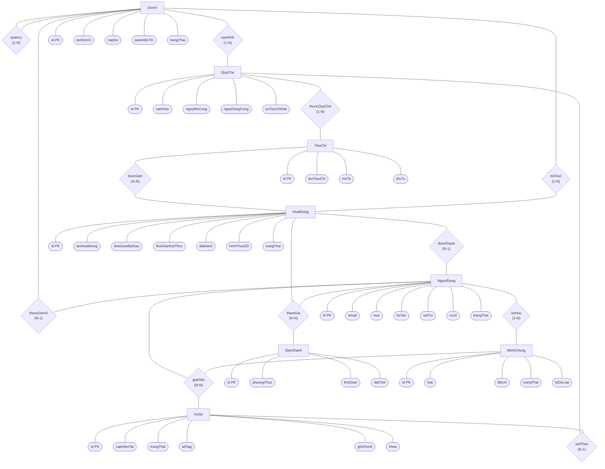

## IV. THIẾT KẾ CƠ SỞ DỮ LIỆU

---

### 4.1. Kiến trúc lưu trữ tổng thể

Hệ thống áp dụng chiến lược **Polyglot Persistence** (Lưu trữ đa dạng):

| Hệ thống | Công nghệ | Dữ liệu lưu trữ |
|:---|:---|:---|
| **RDBMS** | PostgreSQL | Tài khoản, Đơn vị, Quy chế năm học, Tiêu chí, Hoạt động, Điểm danh, Minh chứng, Hồ sơ xét duyệt |
| **NoSQL** | MongoDB | Audit Log bất biến, Dữ liệu thô OCR từ SmartReader, Lịch sử Chatbot RAG, Lịch sử thông báo |

---

### 4.2. Xác định thực thể (Entity Identification)

#### 4.2.1. Thực thể PostgreSQL

| STT | Tên thực thể | Ký hiệu | Mô tả nguồn gốc nghiệp vụ |
|:---|:---|:---|:---|
| 1 | Đơn vị | DonVi | Tổ chức Hội 4 cấp: TW → Tỉnh/TP → Trường → Khoa/CLB (FR02) |
| 2 | Người dùng | NguoiDung | Tài khoản của tất cả actor trong hệ thống (UC01, UC02) |
| 3 | Quy chế năm học | QuyChe | Cấu hình quy tắc xét duyệt — mỗi trường mỗi năm có thể khác nhau (UC35, BR01) |
| 4 | Tiêu chí SV5T | TieuChi | Bộ tiêu chí cụ thể thuộc một Quy chế (UC34) |
| 5 | Hoạt động | HoatDong | Sự kiện do Đơn vị tổ chức hoặc Hội tự tạo (UC06, UC07) |
| 6 | Điểm danh | DiemDanh | Ghi nhận tham gia của sinh viên tại sự kiện (UC11, UC12) |
| 7 | Minh chứng | MinhChung | File và trạng thái xét duyệt của từng bằng chứng (UC16, UC18) |
| 8 | Hồ sơ SV5T | HoSo | Hồ sơ tổng hợp sinh viên nộp trong đợt xét (UC24, UC26) |

#### 4.2.2. Thực thể MongoDB

| STT | Tên Collection | Mô tả nguồn gốc nghiệp vụ |
|:---|:---|:---|
| 1 | audit_logs | Ghi lại mọi thao tác quan trọng, bất biến (BR09) |
| 2 | ocr_results | Dữ liệu thô SmartReader trả về (UC17) |
| 3 | chatbot_conversations | Lịch sử Q&A giữa sinh viên và Smartbot (UC21) |
| 4 | notifications | Nhắc deadline, kết quả duyệt gửi tới sinh viên (FR17) |

---

### 4.3. Thiết kế CSDL Logic — ERD (Ký pháp Chen)

> **Ghi chú ký pháp:** Hình chữ nhật = Thực thể | Hình bầu dục = Thuộc tính | Hình thoi = Quan hệ | Thuộc tính gạch chân = Khóa chính

#### 4.3.1. ERD — PostgreSQL



#### 4.3.2. ERD — MongoDB Collections

```mermaid
graph TB
    %% ===================== COLLECTIONS =====================
    AL["audit_logs"]
    OCR["ocr_results"]
    CB["chatbot_conversations"]
    NTB["notifications"]

    %% ===================== THUỘC TÍNH audit_logs =====================
    AL_id(["_id ObjectId PK"])
    AL_uid(["userId ref-PG"])
    AL_act(["action"])
    AL_ent(["entityType"])
    AL_eid(["entityId ref-PG"])
    AL_old(["oldData JSON"])
    AL_new(["newData JSON"])
    AL_ip(["ipAddress"])
    AL_ts(["timestamp"])

    AL --- AL_id
    AL --- AL_uid
    AL --- AL_act
    AL --- AL_ent
    AL --- AL_eid
    AL --- AL_old
    AL --- AL_new
    AL --- AL_ip
    AL --- AL_ts

    %% ===================== THUỘC TÍNH ocr_results =====================
    OCR_id(["_id ObjectId PK"])
    OCR_pid(["proofId ref-PG"])
    OCR_raw(["rawText"])
    OCR_ext(["extractedData JSON"])
    OCR_conf(["confidenceScore"])
    OCR_at(["processedAt"])

    OCR --- OCR_id
    OCR --- OCR_pid
    OCR --- OCR_raw
    OCR --- OCR_ext
    OCR --- OCR_conf
    OCR --- OCR_at

    %% ===================== THUỘC TÍNH chatbot_conversations =====================
    CB_id(["_id ObjectId PK"])
    CB_uid(["userId ref-PG"])
    CB_msg(["messages Array"])
    CB_cr(["createdAt"])
    CB_up(["updatedAt"])

    CB --- CB_id
    CB --- CB_uid
    CB --- CB_msg
    CB --- CB_cr
    CB --- CB_up

    %% ===================== THUỘC TÍNH notifications =====================
    NTB_id(["_id ObjectId PK"])
    NTB_uid(["userId ref-PG"])
    NTB_title(["title"])
    NTB_body(["body"])
    NTB_type(["type"])
    NTB_read(["isRead"])
    NTB_ts(["createdAt"])

    NTB --- NTB_id
    NTB --- NTB_uid
    NTB --- NTB_title
    NTB --- NTB_body
    NTB --- NTB_type
    NTB --- NTB_read
    NTB --- NTB_ts
```



---

### 4.4. Thiết kế CSDL Vật lý (Physical Design)

#### 4.4.1. PostgreSQL — Định nghĩa bảng chi tiết

**Bảng 1: don_vi**

| Tên cột | Kiểu dữ liệu | Ràng buộc | Mô tả |
|:---|:---|:---|:---|
| id | UUID | PK, NOT NULL | Mã đơn vị (tự sinh) |
| ten_don_vi | VARCHAR(255) | NOT NULL | Tên tổ chức |
| cap_do | VARCHAR(20) | NOT NULL | TW / TINH / TRUONG / KHOA_CLB |
| parent_id | UUID | FK don_vi.id | Đơn vị cấp trên (NULL nếu là TW) |
| trang_thai | BOOLEAN | DEFAULT TRUE | Đang hoạt động |
| created_at | TIMESTAMP | DEFAULT NOW() | |

---

**Bảng 2: nguoi_dung**

| Tên cột | Kiểu dữ liệu | Ràng buộc | Mô tả |
|:---|:---|:---|:---|
| id | UUID | PK, NOT NULL | |
| don_vi_id | UUID | FK don_vi.id, NOT NULL | Thuộc đơn vị nào |
| email | VARCHAR(255) | UNIQUE, NOT NULL | Tài khoản đăng nhập |
| msv | VARCHAR(50) | UNIQUE | Mã sinh viên (chỉ sinh viên) |
| mat_khau | VARCHAR(255) | NOT NULL | Bcrypt hash |
| ho_ten | VARCHAR(255) | NOT NULL | |
| vai_tro | VARCHAR(30) | NOT NULL | SINH_VIEN / CB_TRUONG / CB_TINH / CB_TW / ADMIN |
| cccd | VARCHAR(20) | UNIQUE | Số CCCD (eKYC xác thực) |
| trang_thai | VARCHAR(20) | DEFAULT ACTIVE | ACTIVE / LOCKED |

---

**Bảng 3: quy_che**

| Tên cột | Kiểu dữ liệu | Ràng buộc | Mô tả |
|:---|:---|:---|:---|
| id | UUID | PK, NOT NULL | |
| don_vi_id | UUID | FK don_vi.id, NOT NULL | Hội/Trường áp dụng quy chế |
| nam_hoc | VARCHAR(20) | NOT NULL | VD: 2024-2025 |
| ngay_mo_cong | TIMESTAMP | NOT NULL | Thời điểm bắt đầu nhận hồ sơ |
| ngay_dong_cong | TIMESTAMP | NOT NULL | Thời điểm khóa cổng nộp |
| so_tieu_chi_dat | SMALLINT | DEFAULT 5 | Số tiêu chí tối thiểu phải đạt |
| UNIQUE | | (don_vi_id, nam_hoc) | Mỗi trường chỉ có 1 quy chế/năm |

---

**Bảng 4: tieu_chi**

| Tên cột | Kiểu dữ liệu | Ràng buộc | Mô tả |
|:---|:---|:---|:---|
| id | UUID | PK, NOT NULL | |
| quy_che_id | UUID | FK quy_che.id, NOT NULL | Ràng buộc vào đúng Quy chế của năm |
| ten_tieu_chi | VARCHAR(255) | NOT NULL | VD: Học tập tốt, Đạo đức tốt |
| mo_ta | TEXT | | Chi tiết điều kiện đạt tiêu chí |
| thu_tu | SMALLINT | | Số thứ tự hiển thị |

---

**Bảng 5: hoat_dong**

| Tên cột | Kiểu dữ liệu | Ràng buộc | Mô tả |
|:---|:---|:---|:---|
| id | UUID | PK, NOT NULL | |
| ten_hoat_dong | VARCHAR(255) | NOT NULL | |
| don_vi_tc_id | UUID | FK don_vi.id, NOT NULL | Đơn vị trực tiếp tổ chức |
| thoi_gian_bat_dau | TIMESTAMP | NOT NULL | |
| thoi_gian_ket_thuc | TIMESTAMP | NOT NULL | Deadline điểm danh |
| dia_diem | VARCHAR(255) | | |
| hinh_thuc_dd | VARCHAR(20) | NOT NULL | CAMERA / EXCEL / KET_HOP |
| trang_thai | VARCHAR(30) | NOT NULL | CHO_DUYET / DA_DUYET / TU_CHOI / DA_CHOT |
| nguoi_duyet_id | UUID | FK nguoi_dung.id | Cán bộ phê duyệt (Luồng A) |
| ly_do_tu_choi | TEXT | | Nếu từ chối |

---

**Bảng 6: hoat_dong_tieu_chi (Trung gian N-N)**

| Tên cột | Kiểu dữ liệu | Ràng buộc | Mô tả |
|:---|:---|:---|:---|
| hoat_dong_id | UUID | FK hoat_dong.id, NOT NULL | |
| tieu_chi_id | UUID | FK tieu_chi.id, NOT NULL | |
| PRIMARY KEY | | (hoat_dong_id, tieu_chi_id) | |

---

**Bảng 7: diem_danh**

| Tên cột | Kiểu dữ liệu | Ràng buộc | Mô tả |
|:---|:---|:---|:---|
| id | UUID | PK, NOT NULL | |
| hoat_dong_id | UUID | FK hoat_dong.id, NOT NULL | |
| nguoi_dung_id | UUID | FK nguoi_dung.id, NOT NULL | Sinh viên tham gia |
| phuong_thuc | VARCHAR(20) | NOT NULL | CAMERA_VNFACE / UPLOAD_EXCEL |
| thoi_gian | TIMESTAMP | DEFAULT NOW() | Thời điểm hệ thống ghi nhận |
| da_chot | BOOLEAN | DEFAULT FALSE | TRUE sau khi sự kiện kết thúc |
| UNIQUE | | (hoat_dong_id, nguoi_dung_id) | Mỗi SV chỉ tính 1 lần / sự kiện |

---

**Bảng 8: minh_chung**

| Tên cột | Kiểu dữ liệu | Ràng buộc | Mô tả |
|:---|:---|:---|:---|
| id | UUID | PK, NOT NULL | |
| nguoi_dung_id | UUID | FK nguoi_dung.id, NOT NULL | Người sở hữu minh chứng |
| tieu_chi_id | UUID | FK tieu_chi.id | Tiêu chí được đề xuất gán vào |
| loai | VARCHAR(20) | NOT NULL | NOI_BO (auto) / BEN_NGOAI (upload) |
| file_url | VARCHAR(500) | NOT NULL | Link lưu trữ file |
| trang_thai | VARCHAR(30) | NOT NULL | DANG_XL / DA_XAC_THUC / CAN_KIEM_TRA / DA_DUYET / BI_LOAI |
| nguoi_duyet_id | UUID | FK nguoi_dung.id | Cán bộ duyệt (nếu cần kiểm tra) |
| ly_do_loai | TEXT | | Lý do bị loại |
| created_at | TIMESTAMP | DEFAULT NOW() | |

---

**Bảng 9: ho_so_sv5t**

| Tên cột | Kiểu dữ liệu | Ràng buộc | Mô tả |
|:---|:---|:---|:---|
| id | UUID | PK, NOT NULL | |
| nguoi_dung_id | UUID | FK nguoi_dung.id, NOT NULL | Sinh viên nộp hồ sơ |
| quy_che_id | UUID | FK quy_che.id, NOT NULL | Đợt xét duyệt (năm + trường) |
| cap_hien_tai | VARCHAR(20) | NOT NULL | TRUONG / TINH / TW |
| trang_thai | VARCHAR(40) | NOT NULL | DANG_TAO / DA_NOP / CHO_DUYET_TRUONG / DAT_TRUONG / CHO_DUYET_TINH / DAT_TINH / CHO_DUYET_TW / DAT_SV5T / BI_TU_CHOI |
| ai_flag | VARCHAR(10) | | XANH / VANG / DO |
| ghi_chu_ai | TEXT | | Ghi chú của AI sơ duyệt |
| khoa | BOOLEAN | DEFAULT FALSE | TRUE sau khi sinh viên nộp |
| ngay_nop | TIMESTAMP | | Thời điểm chốt nộp |
| UNIQUE | | (nguoi_dung_id, quy_che_id) | 1 sinh viên chỉ có 1 hồ sơ / đợt xét |

---

**Bảng 10: chi_tiet_ho_so (Trung gian N-N)**

| Tên cột | Kiểu dữ liệu | Ràng buộc | Mô tả |
|:---|:---|:---|:---|
| ho_so_id | UUID | FK ho_so_sv5t.id, NOT NULL | |
| minh_chung_id | UUID | FK minh_chung.id, NOT NULL | |
| PRIMARY KEY | | (ho_so_id, minh_chung_id) | |

---

#### 4.4.2. MongoDB — Định nghĩa Document Schema

**Collection 1: audit_logs** *(Chỉ INSERT — không bao giờ UPDATE/DELETE — BR09)*

```json
{
  "_id": "ObjectId",
  "user_id": "UUID - ref nguoi_dung.id (PostgreSQL)",
  "action": "CREATE | UPDATE | APPROVE | REJECT | DELETE | LOGIN",
  "entity_type": "HOAT_DONG | HO_SO | MINH_CHUNG | TIEU_CHI | NGUOI_DUNG",
  "entity_id": "UUID - ref PostgreSQL",
  "old_data": {},
  "new_data": {},
  "ip_address": "string",
  "timestamp": "ISODate"
}
```

---

**Collection 2: ocr_results**

```json
{
  "_id": "ObjectId",
  "proof_id": "UUID - ref minh_chung.id (PostgreSQL)",
  "raw_text": "Toàn bộ văn bản trên ảnh",
  "extracted_data": {
    "ho_ten": "string",
    "ngay_cap": "string",
    "don_vi_cap": "string",
    "loai_chung_chi": "string"
  },
  "confidence_score": 0.95,
  "processed_at": "ISODate"
}
```

---

**Collection 3: chatbot_conversations**

```json
{
  "_id": "ObjectId",
  "user_id": "UUID - ref nguoi_dung.id (PostgreSQL)",
  "messages": [
    {
      "role": "user | assistant",
      "content": "string",
      "sources": ["Tên văn bản quy chế trích dẫn"],
      "timestamp": "ISODate"
    }
  ],
  "created_at": "ISODate",
  "updated_at": "ISODate"
}
```

---

**Collection 4: notifications**

```json
{
  "_id": "ObjectId",
  "user_id": "UUID - ref nguoi_dung.id (PostgreSQL)",
  "title": "string",
  "body": "string",
  "type": "DEADLINE_30D | DEADLINE_7D | DEADLINE_3D | DEADLINE_1D | DEADLINE_2H | PROOF_REJECTED | RECORD_APPROVED | SYSTEM",
  "is_read": false,
  "created_at": "ISODate"
}
```
