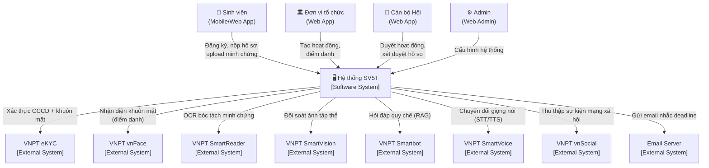
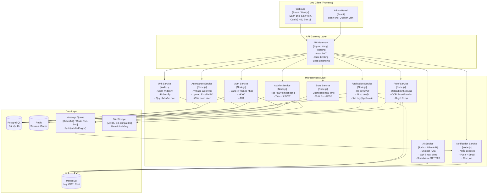
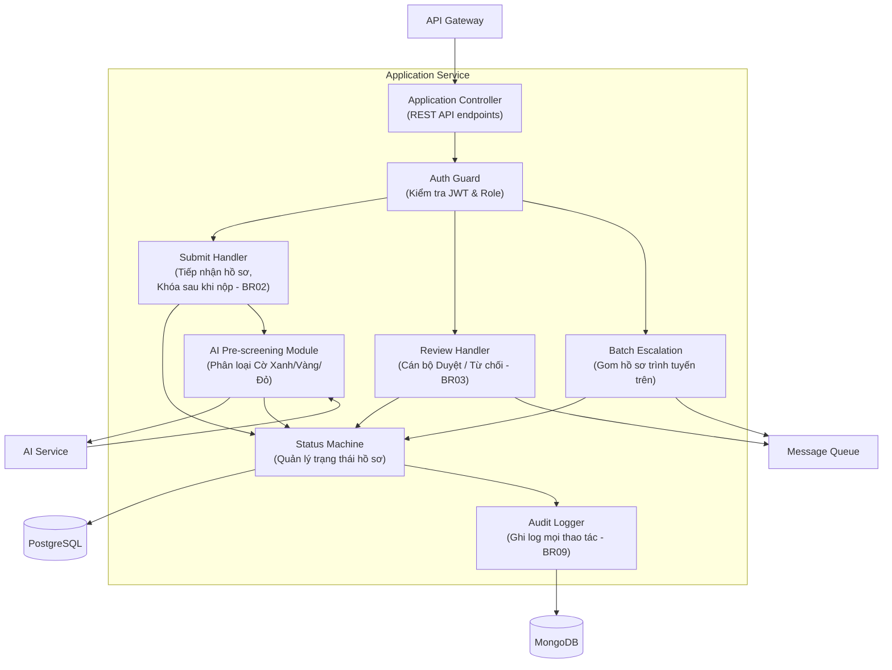
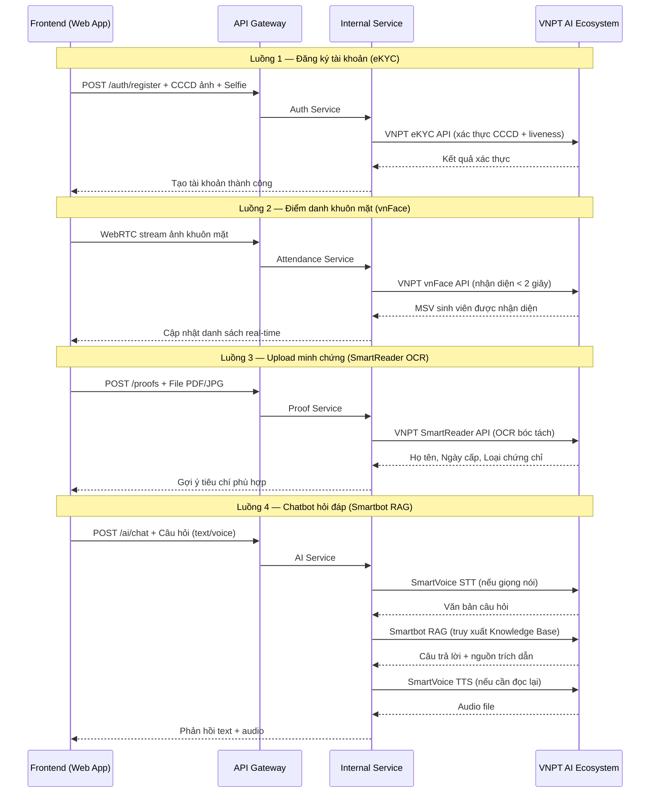
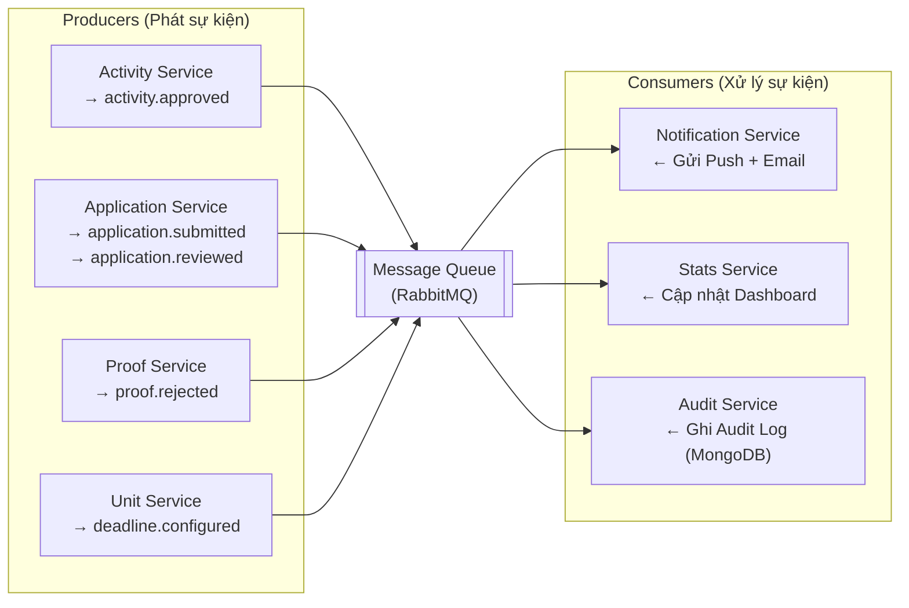
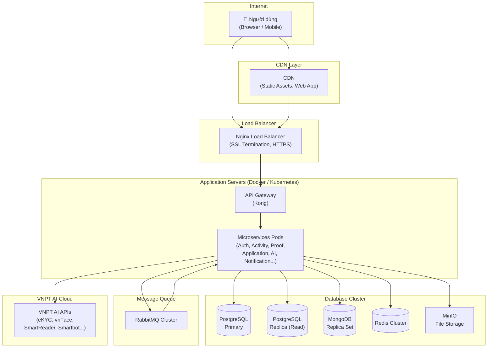

## V. THIẾT KẾ KIẾN TRÚC HỆ THỐNG

---

### 5.1. Tổng quan kiến trúc

Hệ thống quản lý Sinh viên 5 Tốt được thiết kế theo mô hình **Microservices** kết hợp **API Gateway** — đảm bảo khả năng mở rộng độc lập từng nghiệp vụ, tích hợp linh hoạt với hệ sinh thái AI của VNPT, và duy trì tính ổn định khi một dịch vụ xảy ra sự cố.

| Nguyên tắc | Mô tả |
|:---|:---|
| **Separation of Concerns** | Mỗi Microservice đảm nhận đúng 1 nghiệp vụ |
| **API-First** | Tất cả giao tiếp qua REST API / WebSocket |
| **Polyglot Persistence** | PostgreSQL + MongoDB tuỳ từng service |
| **Graceful Degradation** | AI hỏng → nghiệp vụ lõi vẫn chạy bình thường |
| **Event-Driven** | Thông báo, deadline tự động qua Message Queue |

---

### 5.2. Mô hình C4 — Cấp độ 1: Sơ đồ Ngữ cảnh (Context Diagram)

> Mô tả: Hệ thống SV5T tương tác với ai và với hệ thống nào ở bức tranh toàn cảnh.

---

### 5.3. Mô hình C4 — Cấp độ 2: Sơ đồ Container (Container Diagram)

> Mô tả: Bên trong hệ thống SV5T gồm những container (ứng dụng, CSDL, message queue) nào.

---

### 5.4. Mô hình C4 — Cấp độ 3: Sơ đồ Component (Component Diagram)

> Mô tả chi tiết bên trong **Application Service** — service phức tạp nhất (xử lý toàn bộ luồng hồ sơ SV5T).

---

### 5.5. Luồng tích hợp VNPT API

> Mô tả luồng dữ liệu giữa các service nội bộ và hệ sinh thái VNPT AI.

---

### 5.6. Luồng sự kiện bất đồng bộ (Event-Driven)

> Các sự kiện quan trọng được đẩy vào Message Queue để xử lý bất đồng bộ, đảm bảo không block luồng nghiệp vụ chính.

**Bảng danh sách sự kiện:**

| Tên sự kiện | Publisher | Consumer | Mô tả |
|:---|:---|:---|:---|
| `activity.approved` | Activity Service | Notification Service | Thông báo cho sinh viên hoạt động mới |
| `activity.closed` | Attendance Service | Stats Service | Cập nhật thống kê sau khi chốt điểm danh |
| `application.submitted` | Application Service | Notification Service, AI Service | Kích hoạt AI sơ duyệt sau khi hồ sơ được nộp |
| `application.reviewed` | Application Service | Notification Service | Thông báo kết quả duyệt đến sinh viên |
| `proof.rejected` | Proof Service | Notification Service | Thông báo minh chứng bị loại |
| `deadline.configured` | Unit Service | Notification Service | Lập lịch toàn bộ chuỗi nhắc deadline (BR01) |

---

### 5.7. Chiến lược triển khai (Deployment Architecture)

**Bảng môi trường triển khai:**

| Thành phần | Công nghệ | Ghi chú |
|:---|:---|:---|
| Containerization | Docker + Docker Compose | Development / Staging |
| Orchestration | Kubernetes (K8s) | Production |
| CI/CD | GitHub Actions | Auto build, test, deploy |
| API Gateway | Kong | Auth, Rate Limit, Routing |
| Load Balancer | Nginx | SSL, HTTPS, Static files |
| File Storage | MinIO | Tương thích S3 |
| Message Queue | RabbitMQ | Event-driven notifications |
| Cache | Redis | Session, Token, Cache API |

---

### 5.8. Bảo mật hệ thống

| Lớp | Cơ chế | Mô tả |
|:---|:---|:---|
| **Xác thực** | JWT + Refresh Token | Tất cả API đều yêu cầu Bearer Token |
| **Phân quyền** | RBAC + Unit Scope | Cán bộ chỉ xem dữ liệu trong phạm vi đơn vị mình |
| **Truyền tải** | HTTPS / TLS 1.3 | Mã hóa toàn bộ kênh truyền |
| **Lưu trữ** | Bcrypt (mật khẩu), Mã hóa AES (CCCD) | Bảo vệ dữ liệu nhạy cảm |
| **Kiểm soát** | Audit Log bất biến (MongoDB) | Ghi lại mọi thao tác quan trọng (BR09) |
| **Rate Limiting** | Kong Gateway | Chống tấn công DDoS / Brute Force |
